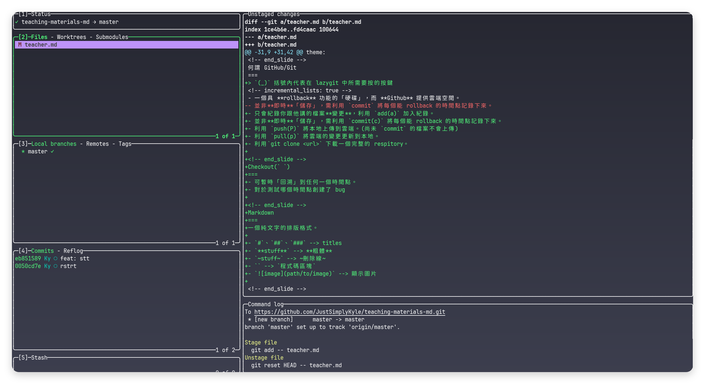

前製軟體
===
- github cli(`winget install -e --id GitHub.cli`)
- git(`winget install -e --id Git.Git`)
- lazygit(`winget install -e --id JesseDuffield.lazygit`)

<!-- end_slide -->
何謂 GitHub/Git
===
> `(_)` 括號內代表在 lazygit 中所需要按的按鍵
<!-- incremental_lists: true -->
- 一個具 **rollback** 功能的「硬碟」，而 **Github** 提供雲端空間。
- 只會紀錄你跟他講的檔案**變更**，利用 `add(a)` 加入紀錄。
- 並非**即時**「儲存」，需利用 `commit(c)` 將每個能 rollback 的時間點記錄下來。
- 利用 `push(P)` 將本地上傳到雲端。(尚未 `commit` 的檔案不會上傳)
- 利用 `pull(p)` 將雲端的變更更新到本地。
- 利用`git clone <url>` 下載一個完整的 respitory。

<!-- end_slide -->
Checkout(` `)
===
- 可暫時「回溯」到任何一個時間點。
- 對於測試哪個時間點創建了 bug

<!-- end_slide -->
Lazygit
===

利用 `[` `]` 選擇目前區塊(不同的區塊，同一個按鍵可能表達不同意思)
按下 `?` 可跳出簡介
# 第 2 區塊
- 利用 空白鍵 加入紀錄(綠色為新增，紅色為刪除)
- 利用 `c` 將此時間點紀錄下來
# 第 4 區塊
- `d` 可將某個時間點所做的變更**完全刪除**
- 利用 空白鍵 可回溯到任一個時間點

<!-- end_slide -->
Markdown
===
一個純文字的排版格式。

- `#`、`##`、`###` --> titles
- `**stuff**` --> **粗體**
- `~stuff~` --> ~刪除線~
- `` --> `程式碼區塊`
- `` --> 顯示圖片

<!-- end_slide -->
Github + Markdown
若將 markdown 檔案上傳到 GitHub 上，可使 GitHub 幫你渲染出來。
<!-- end_slide -->
練習
===

# 練習一：上傳 README.md 到 GitHub 上
> 提示，可利用 `gh repo create` 來創建一個全新的 git 資料夾

# 練習二：上傳一個專案
- 可以是 Python、C++、Rust
> 提示，可利用 `gh repo create` 來將你目前專案的資料夾轉換成
# 練習三：嘗試在不同時間點中 checkout 看看
